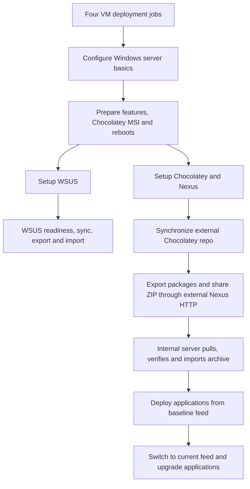

# Disconnected application deployment

AAP invokes Chocolatey CLI over WinRM on the managed Windows endnodes. Chocolatey
is an installation tool, not a polling agent service. Both repository guests host
WSUS and Nexus Repository Community Edition. Windows updates use WSUS; application
packages use Nexus hosted NuGet feeds.

## Modular stages

Each stage has its own playbook and AAP job template. The application branch starts
after repository preparation and Chocolatey setup; the WSUS branch runs separately.

| Stage | Playbook | AAP job template suffix |
| --- | --- | --- |
| Services and clients | `setup_chocolatey.yml` | Setup Chocolatey |
| Acquire selected software | `synchronize_external_chocolatey_repo.yml` | Synchronize External Chocolatey Repo |
| Export and HTTP sharing | `export_external_chocolatey_repo.yml` | Export External Chocolatey Repo |
| Internal pull and import | `replicate_and_import_chocolatey.yml` | Replicate and Import Chocolatey |
| Install older versions | `deploy_baseline_applications.yml` | Deploy Baseline Applications |
| Switch feed and upgrade | `upgrade_applications.yml` | Upgrade Applications |

Template names have the prefix **Disconnected Windows Patching -**.



Every edge requires success. Four VM jobs converge before Windows basics. WSUS and
Chocolatey setup run in parallel after the feature/MSI/reboot preparation barrier.
The workflow deploys new clones; use individual configuration templates for
existing VMs. Application stages do not patch Windows through WSUS.

## Targeted content

`vars/chocolatey_packages.yml` is the public, versioned package selection.

| Application | Package ID | Baseline package / vendor version | Current package / vendor version |
| --- | --- | --- | --- |
| 7-Zip x64 MSI | `7zip.install` | `26.3.0` / `26.03` | `26.4.0` / `26.04` |
| Git for Windows x64 | `git.install` | `2.55.0.5` / `2.55.0.windows.5` | `2.56.0.2` / `2.56.0.windows.2` |

These are locally maintained demo packages built from official vendor installers,
not copied Chocolatey community wrappers. Vendor GitHub release asset SHA-256
checksums are pinned. Packages embed their installers, an installation hook that
checks the embedded installer hash, and public verification information. They have
no package dependencies or Internet downloads during installation. The executable
installers include their vendor license notices. Only the four selected versions
are acquired; the public Chocolatey repository is not mirrored.

7-Zip provides a small installation/upgrade example; Git provides a useful server
administration tool and a larger installer. Both make the version change visible.
Nexus feeds provide release separation; they do not implement Satellite content
views. The four-version export ZIP is approximately 135 MB with these pins.

## Setup remains setup

`setup_chocolatey.yml` downloads and verifies the pinned Nexus Windows ZIP and
Chocolatey MSI. It installs Nexus services with bundled Java, initializes vaulted
administrator passwords, disables anonymous repository access, configures scoped
HTTP firewall rules, and creates empty hosted feeds. External Nexus gets
`chocolatey-staging`; internal Nexus gets `chocolatey-baseline` and
`chocolatey-current`. A dedicated package-reader account can read both internal
feeds.

Managed guests receive Chocolatey CLI, have the public community source removed,
and use the authenticated internal baseline feed. Setup does not fill repositories
or install 7-Zip/Git. The shared preparation stage already bootstraps Chocolatey
and handles reboots before parallel setup, and standalone setup checks it again.
Installers are downloaded to each job's execution-environment temporary directory;
there is no manually staged artifact prerequisite or installer binary in Git.

`vars/application_installers.yml` pins Nexus 3.96.4-01 (approximately 512 MB ZIP)
and Chocolatey 2.7.4 (approximately 6.7 MB MSI). Per-server administrator passwords,
reader credentials, allowed source addresses and complete private feed URLs are
in `vars/wsus_environment_vault.yml`. Redeployment reuses these generated passwords.
Attach the existing Vault credential; tasks carrying credentials always use
`no_log`, independent of the WSUS diagnostic toggle.

## Synchronization and export

Synchronization runs in the AAP execution environment. Native Ansible modules
verify the existing immutable external feed, download the selected vendor
installers and publish only missing package versions through the Nexus Components
API. A small Python helper builds deterministic NuGet-compatible package ZIPs;
there is no Ansible package-creation module. Existing versions are verified against
the exact local artifact hash. Different existing bytes fail rather than being
overwritten. The external feed uses `ALLOW_ONCE`.

Synchronization publishes `synchronized_chocolatey_packages` through `set_stats`.
The following export job consumes these trusted hashes, downloads those exact
Nexus assets and validates the embedded vendor installers and maintained install
hooks. It creates a deterministic ZIP containing `manifest.json` and
`packages/*.nupkg`.

External Nexus creates an immutable raw `chocolatey-exports` feed and serves the
ZIP over its existing HTTP port 8081. There is no additional webserver. The archive
URL ends with its SHA-256 digest and `.zip`; publishing identical content is safe
to repeat. A separate vaulted transfer account has read access only to this export
feed. The export job verifies the shared archive using that reader and passes
`chocolatey_export_descriptor` (URL, archive hash, manifest hash and package count)
to the internal import job through AAP workflow artifacts. No password is placed
in workflow artifacts.

Export is a selected-content export, not a Nexus database or blob-store backup.

## Internal pull, import and two release URLs

`replicate_and_import_chocolatey.yml` targets the internal repository server.
That server downloads the archive directly from external Nexus across the shared
management network; AAP does not relay the archive through WinRM. It requires the
trusted AAP descriptor and the exact expected external-server URL, prevents HTTP
redirects, and verifies the archive checksum. Before extraction it checks the
manifest hash, package selection, package hashes, duplicate entries and safe ZIP
paths. Native `win_unzip` extracts the verified content.

Each package goes to its manifest track's immutable hosted NuGet feed:

| Track | Internal URL path | Content |
| --- | --- | --- |
| Baseline | `/repository/chocolatey-baseline/` | Older pinned 7-Zip and Git packages |
| Current | `/repository/chocolatey-current/` | Newer pinned 7-Zip and Git packages |

The full URLs are vaulted as `chocolatey_baseline_source_url` and
`chocolatey_current_source_url`. Nexus serves both feeds on port 8081. Endnodes
reach internal Nexus over isolation; internal Nexus reaches external Nexus through
its management NIC. AAP's execution node reaches the single-NIC clients through
its own isolated-network NIC, while retaining its management default route.
Neither dual-connected host forwards general client traffic to the Internet.

Native modules handle download, hashing, extraction, repository/account settings
and result verification. The Windows `win_uri` module cannot upload a binary file;
`upload-nexus-package.ps1` supplies just that missing multipart upload to local
Nexus. It runs only for a missing version, rechecks the package hash, uses a
sensitive `PSCredential` parameter and refuses HTTP redirects. Imports validate
the published package bytes using the endnode reader credential. Existing
versions are never overwritten.

## Baseline deployment and upgrade

`deploy_baseline_applications.yml` requires the already installed Chocolatey CLI,
selects the baseline feed as `internal-nexus`, checks it is the only enabled source,
and installs both exact baseline versions with `win_chocolatey`. It does not
bootstrap from the Internet or silently downgrade an unexpected installed version.

`upgrade_applications.yml` first requires both packages to be installed at a known
baseline or current version. It switches that same source to the current URL and
uses native `win_chocolatey` upgrade operations with exact pinned versions. A
successful rerun at current versions makes no application changes. Both jobs
reboot only if required, check the final installed Chocolatey package versions and
selected source, and report the verified application versions.

The feeds have different URLs; there is no mutable alias that silently changes
what an older deployment installs.

## Standalone launches and validation

Synchronization can run independently once external Nexus is ready. A standalone
export launch needs `synchronized_chocolatey_packages` from the synchronization
job's artifacts. A standalone import launch needs `chocolatey_export_descriptor`
from the export job. These templates allow launch variables, and workflow edges
pass artifacts automatically. Relaunching a previous successful export or import
retains that run's inputs. Baseline and upgrade templates load their private URLs
and credentials directly from Vault.

```bash
ansible-galaxy collection install -r collections/requirements.yml
ansible-playbook -i inventory.ini setup_chocolatey.yml --syntax-check --vault-password-file /path/to/vault-password
ansible-playbook -i inventory.ini synchronize_external_chocolatey_repo.yml --syntax-check --vault-password-file /path/to/vault-password
python3 -m unittest discover -s tests -v
```

The EE needs `pywinrm`, Python 3.8 or later, and ansible-core 2.18 or later for the
pinned Chocolatey collection. Package/export helpers use the Python standard
library. Ten local tests cover binary upload integrity, repeatable artifacts,
offline hooks, checksum mismatch, modified-hook refusal and Windows path
validation through Ansible's actual conditional parser. Run the suite with a
Python interpreter that has ansible-core and PyYAML installed. The Nexus path
checks use full matching and correctly escaped Windows separators; this fixes
the setup assertion that incorrectly rejected its default directories. All four real vendor
installers were downloaded and their pinned hashes verified; deterministic
packages and the approximately 135 MB export archive were exercised with them.
Local syntax checking passed for setup and all five application stages.

Live Nexus import and endnode upgrades remain unvalidated. The latest complete
environment deployment stopped during Windows 2025 network configuration before
WSUS/Chocolatey setup. The network launcher was corrected to use Windows Task
Scheduler after a SYSTEM token-creation error; a visible-log Windows Server 2025
test passed static configuration and reconnection. Full service setup remains to
be exercised in the fresh workflow. VM creation succeeded. Historical WinRM connectivity and WSUS configuration were
validated before the teardown/redeployment.

Both repository guests retain the requested demo allocation of 2 vCPUs and 8 GiB
RAM; endnodes retain 2 vCPUs and 2 GiB RAM. Disk sizing stays unchanged. Check shared
WSUS/Nexus memory and disk capacity during live validation. This initial setup
refuses implicit Nexus distribution upgrades and does not automatically remove
old export archives or release content.

## Remaining work

- Validate Nexus startup, upload/import APIs and both application upgrades live.
- Exercise the corrected Windows basics stage in the fresh environment workflow.
- Add WSUS client approvals and Windows patch installation as separate stages.
- Decide retention for old application archives and repository releases.
- Implement a broader package/dependency selection only if the demo needs it.

References:

- [Nexus Windows service installation](https://help.sonatype.com/en/run-as-a-service.html)
- [Nexus distribution downloads](https://help.sonatype.com/en/download.html)
- [Nexus Components API](https://help.sonatype.com/en/components-api.html)
- [Nexus NuGet repositories](https://help.sonatype.com/en/nuget-repositories.html)
- [Chocolatey MSI setup](https://docs.chocolatey.org/en-us/choco/setup/)
- [Offline Chocolatey packages](https://docs.chocolatey.org/en-us/guides/create/recompile-packages/)
- [NuGet package format](https://learn.microsoft.com/en-us/nuget/create-packages/creating-a-package)
- [Git for Windows silent installation](https://github.com/git-for-windows/git-for-windows.github.io/blob/main/content/silent-or-unattended-installation.md)
