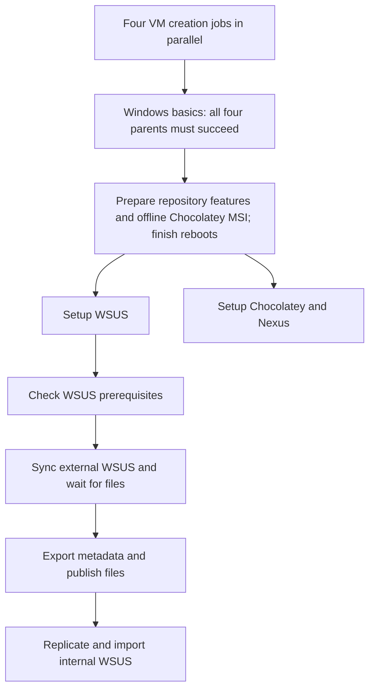

# WSUS synchronization, export and import

The setup stages configure the environment. These three stages populate WSUS:

| Stage | Playbook | AAP job template |
| --- | --- | --- |
| Readiness | `check_wsus_prerequisites.yml` | Disconnected Windows Patching - Check WSUS Prerequisites |
| Microsoft synchronization and file download | `sync_external_wsus.yml` | Disconnected Windows Patching - Sync External WSUS |
| Metadata export and HTTP publication | `export_external_wsus.yml` | Disconnected Windows Patching - Export External WSUS |
| Direct transfer and offline import | `replicate_and_import.yml` | Disconnected Windows Patching - Replicate and Import WSUS |

Readiness job 1072 passed without changing servers or downloading updates. External
WSUS had 25.13 GiB free, running WSUS/IIS services, working Microsoft DNS/TCP
connectivity, and no previous synchronization. BITS was enabled but stopped; the
sync playbook starts it using `win_service`. The TCP probes establish basic egress,
not successful TLS/SOAP synchronization or reachability of every Microsoft CDN;
the actual synchronization and download stages check their own outcomes.

## Workflow and parallel setup

The deployment workflow runs:



All arrows are success transitions. The two setup branches run concurrently after
the preparation stage finishes feature/MSI installation and all required reboots.
This avoids one job rebooting a guest while the other configures it. The preparation
playbook requires the offline Chocolatey MSI path and checksum. The Chocolatey
branch also requires the Nexus ZIP, distribution directory, hashes, feed URL and
protected credentials described in [application deployment](application-deployment.md).
Those installers and application inputs still need staging before the full workflow
can run. Population jobs do not require Nexus or Chocolatey installers and can run
individually against the existing WSUS environment.

Standalone `setup_wsus.yml` and `setup_chocolatey.yml` retain their feature/MSI
bootstrap tasks, using the same shared task files as preparation. Do not launch
those two standalone templates concurrently on unprepared guests. Deployment
rejects existing VMs and clone disks; use the individual population templates for
the already running environment.

## External synchronization

`vars/wsus_pipeline.yml` contains generic defaults. Launch extra variables can
override them. The synchronization template survey supplies the logging toggle,
lookback period and update-count limit.

| Input | Default / behavior |
| --- | --- |
| `wsus_products` | Microsoft Server operating system-21H2 and Microsoft Server operating system-24H2 (Server 2022/2025) |
| `wsus_classifications` | Security Updates and Critical Updates |
| `wsus_languages` | English (`en`) |
| `wsus_update_age_days` | 180 days |
| `wsus_max_selected_updates` | 30, including file-bearing prerequisites |
| `wsus_download_reserve_gb` | 4 GiB kept free |
| `wsus_minimum_free_gb` | 8 GiB readiness minimum; a later size estimate must also pass |
| `wsus_sync_timeout` | 2 hours per metadata synchronization |
| `wsus_download_timeout` | 6 hours for update files |
| `wsus_no_log` | `true`; survey can enable diagnostics without exposing credential values |

The playbook first synchronizes the category catalogue, selects exact products and
classifications, then synchronizes update metadata. Both runs must succeed. Local
full-file storage is enabled; express downloads and automatic synchronization are
disabled. Download-on-approval avoids fetching every historical update.

Selection uses latest, non-declined, non-superseded revisions within the lookback,
excluding Preview, ARM64, x86 and Itanium titles for this x64 demo. File-bearing
prerequisites discovered through the WSUS API are included even if older or
superseded. This matters for checkpoint updates and older base images. A count
limit and conservative file-size estimate stop oversized selections before approval;
the download loop cancels pending selected downloads if the free-space reserve is
reached. Broadening products/classifications or repeating many releases may require
more storage; no disk is resized by this pipeline.

Required license agreements are accepted and install approvals are made only for
the empty `AAP-DownloadOnly` group on external WSUS. A nonempty group is rejected.
No managed client is assigned to it. Completion requires every selected update's
WSUS state to be `Ready`, covering update files and bundled children. A successful
metadata sync alone does not qualify. Selection is recorded locally for export.
On download timeout, WSUS may continue downloading; rerun synchronization after
inspecting its state. Export refuses incomplete downloads.

## Export and HTTP publication

`WSUSutil.exe export` writes complete database metadata to a unique `.xml.gz` file.
Update binaries are separate. The existing IIS installation serves metadata from
`wsus_export_root` and exposes existing `WsusContent` through a static virtual
directory. No second copy of update files is created on external WSUS. Export logs
are kept outside the web root. Directory listings and executable handlers are
disabled; only GET/HEAD static responses are configured.

Network configuration is stored in `vars/wsus_environment_vault.yml`:

| Vault key | Purpose |
| --- | --- |
| `wsus_transfer_bind_address` | External WSUS management NIC address |
| `wsus_transfer_allowed_sources` | Internal WSUS management address(es) allowed through Windows Firewall |
| `wsus_transfer_base_url` | External management HTTP URL, including `wsus_transfer_port` |

The site uses port 8085 by default, independently of WSUS and Nexus. It binds to
the management NIC. Internal WSUS uses its second NIC to download directly from
external WSUS over their shared network. No DNS, router, AAP relay, or new Internet
access is required on internal WSUS. HTTP carries public update data on this demo
management segment. It has no transport confidentiality; the manifest is pinned
through authenticated WinRM and every downloaded file is checked with SHA256.

Each manifest records the metadata checksum, content-relative paths, lengths,
SHA256 hashes, languages, express setting and selected update revisions. The
`current.json` pointer is published only after export and hashing complete. Identical
selection/content reuses an existing valid export. Do not run content cleanup or
modify files while a snapshot is being transferred. Snapshots reference the live
content directory; they are not independent binary backups. Old metadata snapshots
and import logs are retained; retention/cleanup is future work.

## Replication and import

The import job targets internal WSUS. AAP reads the snapshot reference and obtains
its manifest checksum from external WSUS over authenticated WinRM. Internal WSUS
then downloads that immutable manifest over HTTP and verifies the trusted hash.
Actual update bytes flow external-to-internal, never through AAP.

Manifest schema, paths, duplicate entries, hashes and disk space are checked before
transfer. Internal languages and express settings are reconciled to the export,
and automatic synchronization stays disabled. `win_file` creates content
subdirectories; `win_get_url` downloads missing/mismatched files with SHA256
verification and preserves WSUS's relative directory structure. Matching files
are not downloaded again. Downloads are made directly into `WsusContent` to avoid
a second full copy on the internal disk. Proxy use and HTTP redirects are disabled.

After all content is verified, metadata is downloaded and checked, then
`WSUSutil.exe import` runs locally on internal WSUS. Successful import is recorded
with a checksum marker, using `win_copy`; repeating the same snapshot verifies
content and skips the already imported metadata. Every selected update revision
must exist in the internal database before the marker is written. No internal
Microsoft/upstream synchronization, client approval or patch installation starts.
Approvals are separate from WSUSutil metadata transfer and need a later stage.
Validate client applicability and any additional prerequisites before patching
the older Windows base images.

## Module use and validation

Ordinary configuration uses Ansible modules: `win_feature`, `win_reboot`,
`win_service`, `win_file`, `win_copy`, `win_acl`, `win_reg_stat`, `win_stat`, IIS
modules, `win_firewall_rule`, `win_uri`, `win_get_url`, `win_package` and
`win_chocolatey_source`. Chocolatey detection uses native registry/file inspection.
The pinned `community.windows` IIS modules remain available in version 3.3.0;
they are deprecated upstream in favor of `microsoft.iis`, a future migration.

PowerShell is used for WSUS's administration API, its vendor export/import utility,
manifest generation/validation, free-space calculations and the script parser.
These do not have equivalent modules in the pinned collections. Directory/file
bookkeeping inside the export transaction supports unique snapshots and atomic
publication; normal directories, transfer, ACLs and import markers use modules.
Scripts use `SupportsShouldProcess`/Ansible check-mode guards and explicit change
reporting. Sync is an explicit refresh operation, not a no-op on rerun. Windows
long-running WSUS operations execute asynchronously as SYSTEM and use
`ansible.builtin.async_status` with matching credentials/account for polling.

```bash
ansible-playbook -i inventory.ini prepare_repository_servers.yml --syntax-check
ansible-playbook -i inventory.ini sync_external_wsus.yml --syntax-check
ansible-playbook -i inventory.ini export_external_wsus.yml --syntax-check --vault-password-file /path/to/vault-password
ansible-playbook -i inventory.ini replicate_and_import.yml --syntax-check --vault-password-file /path/to/vault-password
```

The prerequisite job also parses all pipeline scripts with the actual Windows
PowerShell parser without executing them. Syntax checks and readiness do not
constitute an end-to-end synchronization/export/import test. These new population
stages have not downloaded, exported or imported updates yet.

Microsoft references:

- [Disconnected WSUS content and metadata procedure](https://learn.microsoft.com/en-us/security-updates/windowsupdateservices/18126805)
- [Current WSUSutil XML.GZ export/import syntax](https://learn.microsoft.com/en-us/intune/configmgr/sum/get-started/synchronize-software-updates-disconnected)
- [Download-on-approval and local/express file configuration](https://learn.microsoft.com/en-us/previous-versions/windows/desktop/ms744600(v=vs.85))
- [WSUS update readiness states](https://learn.microsoft.com/en-us/openspecs/windows_protocols/ms-wsusar/a7937c81-7872-4643-8cdb-1ebcf7296b9c)
- [Required update relationships](https://learn.microsoft.com/en-us/previous-versions/windows/desktop/ms752947(v=vs.85))
- [Server 2022 product selection](https://support.microsoft.com/en-us/servicing/os/windows-server/2025/11/november-11-2025-kb5068787-os-build-20348-4405)
- [Server 2025 product selection](https://support.microsoft.com/en-us/servicing/os/windows-server/2025/06/june-10-2025-kb5060842-os-build-26100-4349)
